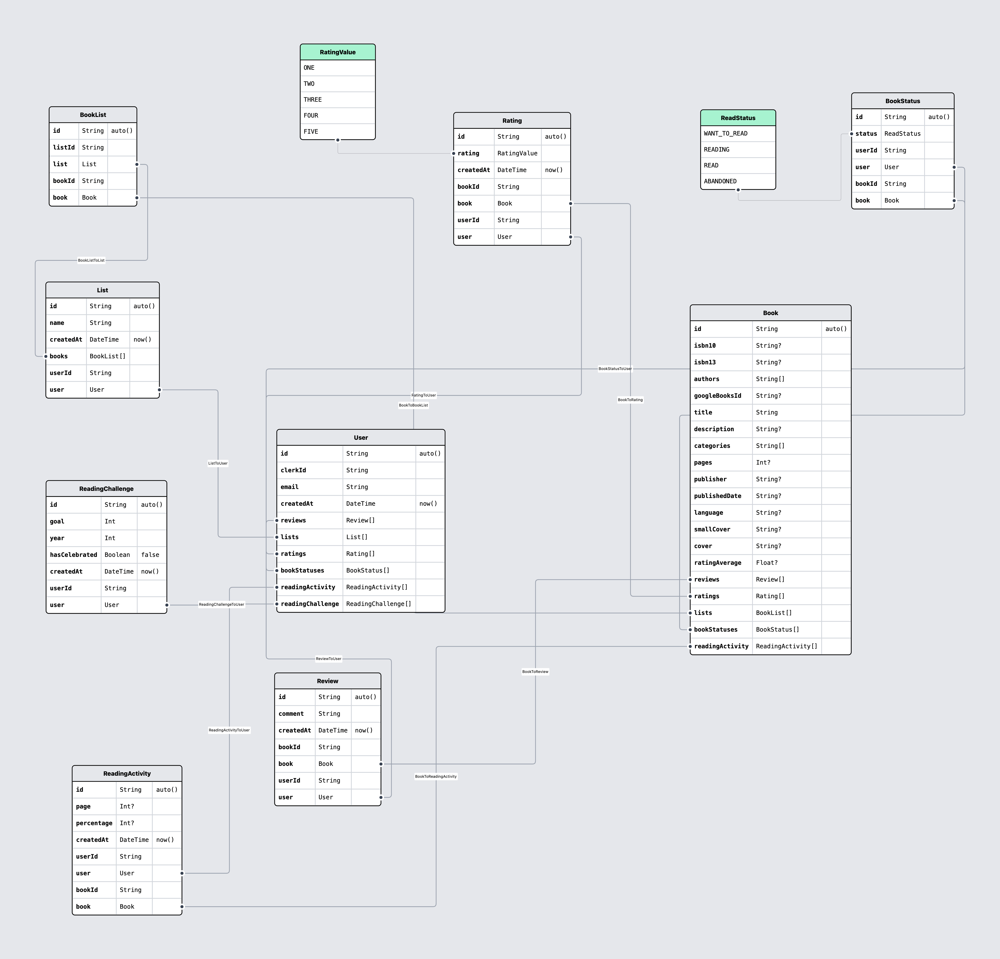

# BookJourney

[BookJourney Application URL](https://bookjourney.vercel.app/)

You will need to register with your Google account to access all the functionalities.

## Members of the team:

- Ferran Bals Moreno <ferranbals@gmail.com> ([franksparks](https://github.com/franksparks))
- Luis Antonio Castro <luisantoniokoyari@gmail.com> ([Luisantonio88](https://github.com/Luisantonio88))
- Gloria Hornero <mghornero@gmail.com> ([MadameSheema](https://github.com/MadameSheema))
- Martín Alarcón <cristianma.2109@gmail.com> ([vedderzeznick](https://github.com/vedderzeznick))

## Summary of the project

BookJourney allows the users to track their reading activity.

In order to get books information [GoogleBooksAPI](https://developers.google.com/books?hl=es-419) is being used.

Users can store books as <em>Want to read</em>, <em>Reading</em> or <em>Read</em> status, or add books to their own lists as well.

To promote reading, users can set a Reading Challenge for the current year.

Users can also set ratings (up to 5 stars) and reviews to the books.

### Serveless application

BookJourney <strong>does not have an API</strong>, we are running serverless by running actions directly to the database.

### Database

We are using [MongoDB](https://www.mongodb.com) as DB provider.

### Prisma schema

Detailed model via [Prismaliser](https://prismaliser.app/):

### Running the project

Steps to run the project:

1. ⁠⁠Clone this repository.
2. ⁠Install dependencies -> <code>bun install</code>
3. ⁠Set up a <em>.env</em> file with credentials for:
   1. MongoDB
   2. Clerk
4. ⁠Generate the database<code>bun x prisma db push</code>

### Screenshots

- Main screen

- Updating reading activity

- Book details screen

- Advanced Search screen

- User lists screen

- Completed Reading Challenge (congratulations!)

  
